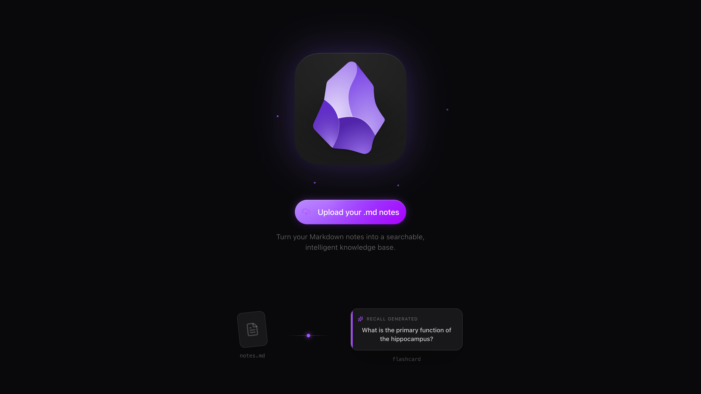

# Obsidian Knowledge Base RAG

> Local-first Retrieval-Augmented Generation (RAG) system for querying Obsidian Markdown vaults with **source-level citations**.

---




## Build
```
pnpm run dev:full
```

## Overview

This project ingests an Obsidian vault (Markdown files), builds a structured knowledge index, and enables **question-answering with citations** to exact notes and sections.  
Designed to be **local-first, reproducible, and self-hostable**.

Primary use cases:
- Ask questions over personal notes
- Retrieve answers with precise citations
- Generate study aids (summaries, flashcards)

---

## Core Features

- **Markdown ingestion** with Obsidian-aware parsing
- **Heading-aware chunking** for higher retrieval precision
- **Vector search** over note embeddings
- **Cited answers** linking back to source files + headings
- **Incremental re-indexing** on vault updates
- **Local LLM support** (optional) with cloud fallback

---

## Architecture

    